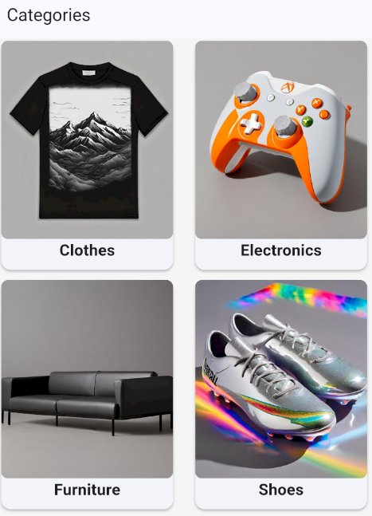
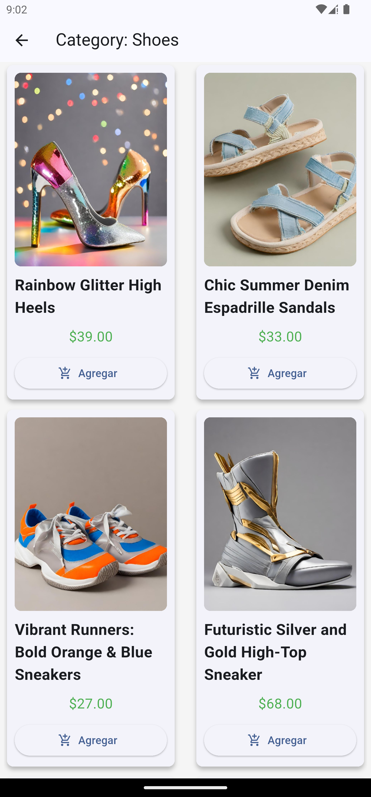

# Tienda Exito

Este proyecto es una aplicación de tienda desarrollada en Flutter. Permite a los usuarios explorar productos por
categorías, visualizar detalles y navegar por un catálogo dinámico.

## Características

- Visualización de productos por categorías.
- Interfaz moderna con cuadrícula tipo Masonry.
- Gestión de estado usando Provider.
- Integración con proveedores de datos para productos y categorías.

## Tecnologías utilizadas

- Flutter (Dart)
- Provider
- flutter_staggered_grid_view
- Dio

## Instalación y ejecución

1. Asegúrate de tener Flutter instalado en tu máquina. Puedes seguir las instrucciones en la [documentación oficial de Flutter](https://flutter.dev/docs/get-started/install).
2. Abre una terminal y navega al directorio del proyecto.
   ```bash
   git clone https://github.com/szuluaga-beep/store
    cd store
    ```
   
3. Instala las dependencias del proyecto ejecutando:
```bash
   flutter pub get
   ```

4. Ejecuta la aplicación ``flutter run``

## Estructura del proyecto

- `lib/features/categories/presentation/screens/`: Pantallas relacionadas con categorías.
- `lib/features/categories/presentation/providers/`: Proveedores de estado.
- `lib/features/categories/presentation/widgets/`: Widgets reutilizables.

## Notas

- Asegúrate de tener Flutter instalado y configurado en tu sistema.
- Puedes personalizar las categorías y productos modificando los proveedores y modelos correspondientes.

---

¡Disfruta explorando la tienda!



